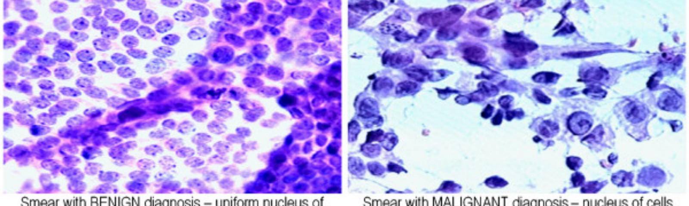
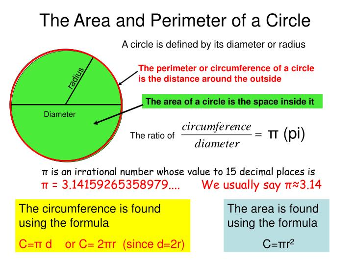

```{r setup, include=FALSE}
knitr::opts_chunk$set(echo = TRUE)
```


## Gerekli Paketlerin ve Veri Setinin Yüklenmesi 


```{r, message=FALSE}
library(tidyverse) # Easily Install and Load the 'Tidyverse', CRAN v1.3.0
library(GGally) # Extension to 'ggplot2', CRAN v2.0.0
library(knitr) # A General-Purpose Package for Dynamic Report Generation in R, CRAN v1.28
library(ggcorrplot) # Visualization of a Correlation Matrix using 'ggplot2', CRAN v0.1.3
library(factoextra) # Extract and Visualize the Results of Multivariate Data Analyses, CRAN v1.0.7
library(gridExtra) # Miscellaneous Functions for "Grid" Graphics, CRAN v2.3
library(ggfortify) # Data Visualization Tools for Statistical Analysis Results, CRAN v0.4.10
library(clustertend) # Check the Clustering Tendency, CRAN v1.4
library(magrittr) # A Forward-Pipe Operator for R, CRAN v1.5
library(cluster) # "Finding Groups in Data": Cluster Analysis Extended Rousseeuw et
library(clValid) # Validation of Clustering Results, CRAN v0.6-7
library(NbClust) # Determining the Best Number of Clusters in a Data Set, CRAN v3.0
library(scales) # Scale Functions for Visualization, CRAN v1.1.1
library(hrbrthemes) # Additional Themes, Theme Components and Utilities for 'ggplot2', CRAN v0.8.0
library(viridis) # Default Color Maps from 'matplotlib', CRAN v0.5.1
library(latex2exp) # Use LaTeX Expressions in Plots, CRAN v0.4.0
library(ggpubr) # 'ggplot2' Based Publication Ready Plots, CRAN v0.3.0
library(mclust) # Gaussian Mixture Modeling for Model-Based Clustering, Classification, and Density Estimation, CRAN v5.4.6
library(fpc) # Flexible Procedures for Clustering, CRAN v2.2-6
library(dbscan) # Density Based Clustering of Applications with Noise (DBSCAN) and Related Algorithms, CRAN v1.1-5
library(ClusterR) # Gaussian Mixture Models, K-Means, Mini-Batch-Kmeans, K-Medoids and Affinity Propagation Clustering, CRAN v1.2.2
library(psych) # Procedures for Psychological, Psychometric, and Personality Research, CRAN v1.9.12.31 
library(reshape2)
```


Veri setinde bulunan değişkenler, bir göğüs kütlesinin ince iğne aspiratının (FNA) sayısallaştırılmış görüntüsünden hesaplanır. Bu değişkenler, aşağıdaki görüntüde yer alan hücre çekirdeklerinin özelliklerini tanımlarlar. 




Değişkenlerin açıklaması aşağıdaki gibidir:

- `diagnosis`: Teşhis (M = Kötü huylu , B = iyi huylu)
- `radius`: Yarıçap (merkezden noktaya olan uzaklıkların ortalamasıdır.)
- `texture`: Doku (gri tonlama değerlerinin standart sapmasıdır.)
- `perimeter`: Çevre uzunluğu (Radyan)
- `area`: Alan 
- `smoothness`: Yumuşaklık (Yarı çap uzunluğundaki yerel değişimler)
- `compactness`: kompaktlık (çevre ^ 2 / alan - 1.0)
- `concavity`: içbükeylik (Oluşan konturların içbükey kısımlarının şiddeti)
- `concave points`: içbükey noktalar (konturun içbükey kısımlarının sayısı)
- `symmetry`: Simetri
- `fractal_dimension`: Fraktal Boyut

Verilerin okunması

```{r}
breast_cancer <- read.csv('Data/datasets.csv', header = TRUE, row.names = 1, stringsAsFactors = FALSE)
breast_cancer <- breast_cancer[,1:11]
names(breast_cancer) <-  gsub(pattern = "_mean*", replacement = "", x = names(breast_cancer))
```

\begin{table}[ht]
\centering
\scalebox{0.7}{
\begin{tabular}{rlrrrrrrrrrr}
  \hline
 & diagnosis & radius & texture & perimeter & area & smoothness & compactness & concavity & concave.points & symmetry & fractal\_dimension \\ 
  \hline
842302 & M & 17.99 & 10.38 & 122.80 & 1001.00 & 0.12 & 0.28 & 0.30 & 0.15 & 0.24 & 0.08 \\ 
  842517 & M & 20.57 & 17.77 & 132.90 & 1326.00 & 0.08 & 0.08 & 0.09 & 0.07 & 0.18 & 0.06 \\ 
  84300903 & M & 19.69 & 21.25 & 130.00 & 1203.00 & 0.11 & 0.16 & 0.20 & 0.13 & 0.21 & 0.06 \\ 
  84348301 & M & 11.42 & 20.38 & 77.58 & 386.10 & 0.14 & 0.28 & 0.24 & 0.11 & 0.26 & 0.10 \\ 
  84358402 & M & 20.29 & 14.34 & 135.10 & 1297.00 & 0.10 & 0.13 & 0.20 & 0.10 & 0.18 & 0.06 \\ 
  843786 & M & 12.45 & 15.70 & 82.57 & 477.10 & 0.13 & 0.17 & 0.16 & 0.08 & 0.21 & 0.08 \\ 
   \hline
\end{tabular}
}
\caption{Veri setinin ilk altı gözlemi} 
\end{table}

## S1: Hücre çekirdeğine ait özelliklerin tanımlayıcı istatistiklerini elde ederek, yorumlayınız.

\begin{table}[!htbp] \centering 
  \caption{Değişkenlere ait açıklayıcı istatistikler} 
  \label{} 
\small 
\begin{tabular}{@{\extracolsep{5pt}}lcccccccc} 
\\[-1.8ex]\hline 
\hline \\[-1.8ex] 
Statistic & \multicolumn{1}{c}{N} & \multicolumn{1}{c}{Mean} & \multicolumn{1}{c}{St. Dev.} & \multicolumn{1}{c}{Min} & \multicolumn{1}{c}{Pctl(25)} & \multicolumn{1}{c}{Median} & \multicolumn{1}{c}{Pctl(75)} & \multicolumn{1}{c}{Max} \\ 
\hline \\[-1.8ex] 
radius & 569 & 14.127 & 3.524 & 6.981 & 11.700 & 13.370 & 15.780 & 28.110 \\ 
texture & 569 & 19.290 & 4.301 & 9.710 & 16.170 & 18.840 & 21.800 & 39.280 \\ 
perimeter & 569 & 91.969 & 24.299 & 43.790 & 75.170 & 86.240 & 104.100 & 188.500 \\ 
area & 569 & 654.889 & 351.914 & 144 & 420.3 & 551.1 & 782.7 & 2,501 \\ 
smoothness & 569 & 0.096 & 0.014 & 0.053 & 0.086 & 0.096 & 0.105 & 0.163 \\ 
compactness & 569 & 0.104 & 0.053 & 0.019 & 0.065 & 0.093 & 0.130 & 0.345 \\ 
concavity & 569 & 0.089 & 0.080 & 0.000 & 0.030 & 0.062 & 0.131 & 0.427 \\ 
concave.points & 569 & 0.049 & 0.039 & 0.000 & 0.020 & 0.034 & 0.074 & 0.201 \\ 
symmetry & 569 & 0.181 & 0.027 & 0.106 & 0.162 & 0.179 & 0.196 & 0.304 \\ 
fractal\_dimension & 569 & 0.063 & 0.007 & 0.050 & 0.058 & 0.062 & 0.066 & 0.097 \\ 
\hline \\[-1.8ex] 
\end{tabular} 
\end{table} 

Veri setindeki değişkenkere ait açıklayıcı istatistiklere baktığımızda, *Çevre* ve *Alan* değişkenleri geometrik olarak *Yarıçap*'dan etkilendiği için *Yarıçap*'daki değişimin fazla olması, kendini bu iki değişken üzerinde göstermektedir. Ayrıca verilerin ortalama, standart sapma ve aralık (range) değerleri birbirinden çok farklı olduğu için çizdireceğimiz boxplot değeri bize net bir bilgi vermeyecektir. Sonuç olarak daha anlamlı bir yorumlama ve hesaplama yapabilmek için bu değişkenlerin scale edilmesi gerekmektedir.


## S2: Korelasyon matrisi elde ederek, yorumlayınız.


```{r message=FALSE, warning=FALSE, fig.align="center"}
ggpairs(breast_cancer, columns = 2:11, ggplot2::aes(colour=diagnosis), 
        title = 'Correlogram of Variables')
```


Şekildeki korelasyon değerlerine baktığımızda *Çevre*, *Alan* ve *Yarıçap* değişkenleri birbirleriyle tam ve güçlü bir şekilde ilişki içindedir. Bunun nedeni, aşağıdaki görselden de görüleceği üzere bu üç değişken birbirinin katıdır. 

<p align="center">
{width=50%}
</p>


Buna benzer olarak fraktal boyut dışındaki tüm değişkenler birbiri ile $0.50$'den yüksek bir ilişkiye sahiptir. Fraktal boyutun diğer değişkenlerle negatif ilişkiye sahip olmasının nedeni, onun doğasından kaynaklanmaktadır. Geometride fraktal boyut, bir şeklin sahip olduğu karmaşıklıklığı ve şeklin içinde yer alan desenlerin birbirine ne kadar benzer olduğunu ölçmektedir. Bu nedenle hücre çekirdeğinin yapısı ne kadar pürüzsüz bir yapıya sahip olan daireye yakınsa fraktal boyutu o kadar düşük çıkmaktadır. Bu nedenle daireye ait olan *Çevre*, *Alan* ve *Yarıçap* parametreleri ile fraktal boyutun negatif ilişki içinde olması beklenen bir durumdur.Ayrıca değişkenlerin dağılımının normal dağılması nedeniyle hesaplanan korelasyon katsayıları $0.95$ anlamlılık düzeyinde anlamlıdır. Son olarak değişkenlerin bu kadar yüksek ilişki içinde olması bize Temel Bileşenler Analizi yapmamızı işaret etmektedir.


## S3: Değişkenler için kutu grafiği (box-plot) çizdirerek, yorumlayınız.


```{r, message=FALSE, warning=FALSE, fig.align="center"}
breast_cancer_scaled <- scale(breast_cancer[,-1])
breast_cancer_scaled <- data.frame(diagnosis = breast_cancer$diagnosis, breast_cancer_scaled)
ggplot(stack(breast_cancer_scaled[,-1]), aes(x = ind, y = values)) +
  geom_boxplot()+ coord_flip() + 
  labs(title = 'Box Plot of Scaled Variables', x = 'Variables', y = 'Values')
```

Scale edilmiş verilere ait boxplot'a baktığımızda bütün değişkenlerde  --özellikle *simetri* ve *yumuşaklık*  değerlerinde-- çok fazla aykırı değerlerin olduğu görülmektedir. Bu durum kümeleme analizinde yüksek performans almak için uzaklık ölçütü olarak *manhattan* ölçütünü kullanmmızı işaret etmektedir. Ayrıca bu aykırı değerler özellikle yoğunluk temelli kümeleme analizinde bize gürültülü gözlem noktası olarak karşımıza çıkacaktır ve bu durum, yoğunluk temellli algoritmanın başarısını etkileyecektir. Bu nedenle daha dayanıklı sonuç almak için bu gibi verilerde k-medoids kullanmamız gerekmekedir. 


## S4: Temel bileşenler analizi uygulayınız.

Veri setindeki değişkenler birbiri ile yüksek derecede ilişkili olduğu için bu ilişkiyi ortadan kaldırmak için
Temel Bileşenler Analizi uygulanmalıdır. Temel Bileşenler analizine geçmeden önce değişkenlere temel bileşen
analizinin yapılıp yapılamayacağını test etmek için *Kaiser-Meyer-Olkin (KMO)* Testi yapılmıştır. Ardından
değişkenlere ait özdeğerleri ve bu özdeğerlerin veri setindeki değişkenliği ne derecede açıkladığını incelenmiştir.

```{r,eval=FALSE}
KMO(r = breast_cancer_scaled[,-1])
```

Elde edilen *Kaiser-Meyer-Olkin (KMO)* Test sonucuna göre değişkenlerin KMO skoru $0.70$'den büyük olduğu ve genel KMO skoru $0.79$ olduğu için veri setimiz Temel Bileşenler Analizi için uygundur.

```{r}
scaled_df_corr_matrix <- cor(breast_cancer_scaled[,-1], method = 'pearson', use = 'complete.obs')
scaled_df_eigen <- eigen(x = scaled_df_corr_matrix)
scaled_df_var <- scaled_df_eigen$values/sum(scaled_df_eigen$values)
scaled_data_cumsum_var <- cumsum(scaled_df_var)
```

\begin{table}[ht]
\centering
\begin{tabular}{rrrr}
  \hline
 & eigenValue & Var & cumsumVar \\ 
  \hline
1 & 5.48 & 0.55 & 0.55 \\ 
  2 & 2.52 & 0.25 & 0.80 \\ 
  3 & 0.88 & 0.09 & 0.89 \\ 
  4 & 0.50 & 0.05 & 0.94 \\ 
  5 & 0.37 & 0.04 & 0.97 \\ 
  6 & 0.12 & 0.01 & 0.99 \\ 
  7 & 0.08 & 0.01 & 1.00 \\ 
  8 & 0.03 & 0.00 & 1.00 \\ 
  9 & 0.01 & 0.00 & 1.00 \\ 
  10 & 0.00 & 0.00 & 1.00 \\ 
   \hline
\end{tabular}
\caption{Değişkenlere ait özdeğer ve Varyans değeleri} 
\end{table}


Temel Bileşenler analizini özdeğer vektörleri üzerinden yapacağımız zaman öz değerlerin birden büyük
olanlarının seçilmesi önerilmektedir. Buna göre veri setimizde bu şartı sağlayan iki adet öz vektörün olduğu
görülmektedir.Açıklanan varyans üzerinden gittiğimizde ise ilk temel bileşenin veri setindeki değişkenliğin %55’ini açıkladığı
görülmektedir. Kümülatif açıklanan varyansa göz attığımızda ise beşinci temel bileşenden itibaren açıklanan
varyansın çok az bir oranla arttığı görülmektedir. Ayrıca açıklanan varyansın en az %75’i olması gerektiği
şartı ikinci temel bileşenden itibaren sağlanmaktadır ve bu sonuç, özdeğer vektörleri ile elde ettiğimiz sonuçla
örtüşmektedir.

```{r}
scaled_df_pca <- prcomp(x = breast_cancer_scaled[,-1])
screeplots <- fviz_screeplot(scaled_df_pca, ggtheme = theme_gray())
pca_p1<- fviz_contrib(scaled_df_pca, choice = "var", axes = 1, top = 10, ggtheme = theme_gray())
pca_p2<- fviz_contrib(scaled_df_pca, choice = "var", axes = 2, top = 10, ggtheme = theme_gray())
pca_p3<- fviz_contrib(scaled_df_pca, choice = "var", axes = 3, top = 10, ggtheme = theme_gray())
pca_p4<- fviz_pca_var(X = scaled_df_pca, col.var = 'contrib', repel = TRUE,gradient.cols = c("#00AFBB", "#E7B800", "#FC4E07"), ggtheme = theme_gray()) + ggtitle("Variables - PCA")
grid.arrange(pca_p1,pca_p2,screeplots,pca_p4, nrow = 2)
```

Temel bileşen Analizinden sonra elde ettiğimiz screeplotta ikinci temel bileşenden itibaren bir dirsek oluştuğu
için yukarıda yaptığımız analizi destekler niteliktedir. Katkı grafiklerinden ilkinden de görüleceği üzere birinci temel bileşen, verideki değişkenliği ençok açıklayan bileşendir.Birinci temel bileşende *yumuşaklık*, *simetri*, *doku* ve *fraktal boyut* değişkenleri dışında başta *konkav nokta* ve *konkavlık* olmak üzere bütün değişkenlerin katkısı varken ikinci temel bileşende başta *fraktal boyut* ve *yumuşaklık* olmak üzere *simetri* ve *yarıçap* değişkeninin katkısı vardır.  Tüm bu değişkenleri dördüncü grafikte topluca incelediğimizde hepsinin aynı yöne bakması nedeniyle değişkenlerin cosine benzerliği çok yüksek olmasına rağmen *doku* ile *fraktal boyut* birbiri ile olan açısı $90^{\circ}$ olduğu için birbirleriyle ilişkisizdir. *Yarıçap*, *çevre* ve *alan* değişkeninin üst üste olması  *Çevre* ve *Alan* değişkenleri geometrik olarak *Yarıçap*'dan etkilendiği için *Yarıçap*'daki değişimin fazla olması, kendini bu iki değişken üzerinde göstermektedir. Sonuç olarak temel bileşenlerden elde ettiğimiz sonuç, en başta incelediğimiz korelasyon matrisi ile doğrudan alakalıdır. Elde ettiğimiz bu iki bileşeni yeni bir değişken olarak tanımlayacak olursak:

- ilk bileşen, hücre çekirdeğinin *düzğünlüğü*'nü açıklayan, diğer bir değişle ne kadar iyi bir daire olduğunu açıklayan değişkendir.
- ikinci bileşen ise hücre çekirdeğinin ne kadar kompleks yapıda olduğunu açıklamaktadır. 

Buna göre ilk bileşen, daha düzgün yapıya sahip olan *iyi huylu* hücreler ile ilgiliyken ikinci bileşen, hücre formu bozulmuş olan *kötü huylu* hücreleri açıklamaktadır.


```{r}
autoplot(scaled_df_pca, data = breast_cancer_scaled, colour = 'diagnosis', loadings = TRUE, label = TRUE, label.size = 3,
         loadings.label = TRUE, loadings.label.size  = 4)
```

*iyi huylu* hücrelerin orjin etrafında toplanması ve çok fazla saçılım göstermememsi, bu hücrelerin yapılarının sağlam, yani tam bir daire şeklinde olmalarından kaynaklanmaktadır. Bu nedenle bu hücreler yukarıda da belirttiğimiz gibi birinci temel bileşenin pozitif olduğu noktada toplanmaktadır. *kötü huylu* hücreler de ise yapılarında bozulma olduğu ve bu bozulmanın hücreden hücreye göre çok fazla değişim göstermesi nedeniyle *kötü huylu* hücreler çok fazla saçılım göstermektedir. Ayrıca, yine yukarıda da belirttiğimiz ikinci temel bileşen *kötü huylu* hücreleri açıklayan bileşen olduğu için *kötü huylu* hücreler ikinci temel bileşenin pozitif olduğu noktada yer almaktadır. 


## S5: K-ortalamalar ile kümeleme analizi uygulayarak, yorumlayınız.

```{r}
rotationed_df <- as.data.frame(predict(scaled_df_pca))
rotationed_df <- data.frame(diagnosis = breast_cancer$diagnosis, rotationed_df[,1:2])
clustertend:: hopkins(rotationed_df[,-1], nrow(rotationed_df[,-1])-1)
```

Hopkins istatistiği değeri 0’a çok yakın ve eşik değeri olan 0.5'den küçük olduğu zaman verilerimizin kümelemeye uygun olduğu söylenebilir. Bu doğrultuda elde ettiğimiz değer eşik değerden düşük olduğu ve sıfıra yakın olduğu için kümeleme analizi için uygundur.


```{r, warning= FALSE, message= FALSE,results='hide', fig.show='hide'}
set.seed(31)
elbow <- fviz_nbclust(rotationed_df[,-1], kmeans, method = "wss", k.max = 24) + 
  ggtitle("the Elbow Method") + theme_gray()
gap <- fviz_nbclust(rotationed_df[,-1], kmeans, method = "gap_stat", k.max = 24) + 
  ggtitle("Gap Statistics") + theme_gray()
silhouette1 <- fviz_nbclust(rotationed_df[,-1], kmeans, method = "silhouette", k.max = 24) + 
  ggtitle("Silhouette Method") + theme_gray()
scaled_nbclust <- NbClust(rotationed_df[,-1], distance = "manhattan", min.nc = 2, max.nc = 10, 
                        method = "ward.D2", index ="all")
nbclust1 <- fviz_nbclust(scaled_nbclust) + theme_gray() + 
  ggtitle("NbClust's optimal number of clusters")
```


```{r, echo= FALSE}
grid.arrange(elbow, gap, silhouette1, nbclust1)
```


wss, gap istatistiği, Silhouette ve nbclust fonksiyonunda yer alan istatistiklerden elde ettiğimiz sonuçlara göre
wss ye göre dirsek k = 2 de sağlanmıştır. Gap istatistiği 2 küme önerirken nbclust fonksiyonunda yer alan
istatistikler çoğunlukla iki ve üç küme önermiştir. Hücrelerin türlerini de göz önüne aldığımızda iki küme bizim için en idealidir.

```{r}
k2 <- kmeans(rotationed_df[,-1], centers = 2, nstart = 25)
fviz_cluster(k2, data = rotationed_df[,-1]) + ggtitle("k = 2")
```


K-ortalamalar yöntemi ile ilk küme 398 kişi ve ikinci küme 171 kişi olacak şekilde kümelenmiştir. Bu
durumda ilk kümenin merkeze yakın olup varyansyonu düşük olan *iyi huylu * hücreler olduğu söylenebilir. Kümelemenin specificity değeri 0.7629 iken sensitivity değeri 0.8799'dur

## S6: K-medoids ile kümeleme analizi uygulayarak,  yorumlayınız. 


```{r, warning= FALSE, message= FALSE,results='hide', fig.show='hide'}
elbow2 <- fviz_nbclust(rotationed_df[,-1], pam, method = "wss", k.max = 24) + ggtitle("the Elbow Method") + theme_gray()
gap2 <- fviz_nbclust(rotationed_df[,-1], pam, method = "gap_stat", k.max = 24) + ggtitle("Gap Statistics") + theme_gray()
silhouette12 <- fviz_nbclust(rotationed_df[,-1], pam, method = "silhouette", k.max = 24) + ggtitle("Silhouette Method") + theme_gray()
scaled_nbclust2 <- NbClust(rotationed_df[,-1], distance = "manhattan", min.nc = 2, max.nc = 10, method = "ward.D2", index ="all",)
nbclust12 <- fviz_nbclust(scaled_nbclust) + theme_gray() + ggtitle("NbClust's optimal number of clusters")
```


```{r, echo= FALSE}
grid.arrange(elbow2, gap2, silhouette12, nbclust12)
```

K-ortalamalar'da da olduğu gibi wss, gap istatistiği, Silhouette ve nbclust fonksiyonunda yer alan istatistiklerden elde ettiğimiz sonuçlara göre wss ye göre dirsek k = 2 de sağlanmıştır. Gap istatistiği 2 küme önerirken nbclust fonksiyonunda yer alan
istatistikler çoğunlukla iki ve üç küme önermiştir. 

```{r}
pam2 <- pam(rotationed_df[,-1],k = 2)
pamg2 <- fviz_cluster(pam2, data = rotationed_df[,-1]) + ggtitle('k')
```


K-medyan yöntemi ile ilk küme 379 kişi ve ikinci küme 190 kişi olacak şekilde kümelenmiştir. Bu Kümelemenin specificity değeri 0.7629 iken sensitivity değeri 0.8799'dur. Sonuç olarak verilerdeki aykırı gözlemleride dikkate aldığımızda K-medyan yönteminin daha iyi performans göstermesi beklenen bir durumdur.


## S7: Aşamalı kümeleme analizi uygulayarak, yorumlayınız. 

Aşamalı kümeleme analizine geçmeden önce aşamalı anakizde kullanılan yöntemlerden hangisinin verimiz için en uygun olduğunu belirleyelim.

```{r}
methods <- c( "average", "single", "complete", "ward")
names(methods) <- c( "average", "single", "complete", "ward")
ac <- function(x) {
  agnes(rotationed_df[,-1], method = x)$ac
}

method_result <- map_dbl(methods, ac)
method_df <- data.frame(methods, method_result)
ggplot(method_df, aes(x=methods, y=method_result)) + 
  geom_bar(stat = "identity", fill = 'steelblue') + labs(title = 'Cluster Methods Comparation', x = 'models', y = 'Percentage of Ac')
```


Elde edilen sonuca göre en yğksek skoru *Ward* yöntemi verdiği için analize *Ward* ile devam edilecektir. *Ward* yöntemi için en uygun küme sayısını hesaplayacak olursak:

```{r, warning= FALSE, message= FALSE,results='hide', fig.show='hide'}
set.seed(31)
elbow3 <- fviz_nbclust(rotationed_df[,-1], FUN = hcut, method = "wss", k.max = 24) + 
  ggtitle("The Elbow Method") + theme_gray()
gap3 <- fviz_nbclust(rotationed_df[,-1], FUN = hcut, method = "gap_stat", k.max = 24) +
  ggtitle("Gap Statistics") + theme_gray()
silhouette13 <- fviz_nbclust(rotationed_df[,-1], FUN = hcut, method = "silhouette", k.max = 24) + 
  ggtitle("Silhouette Method") + theme_gray()
```

```{r}
grid.arrange(elbow3, gap3, silhouette13, nrow = 3)
```

Diğer iki yöntemde de benzer olarak hesaplanan istatistikler, aşamalı analiz için iki küme önermektedir. *Ward* yöntemi ile elimizdeki verileri iki kümeye ayıracak olursak;


```{r}
distance <- dist(rotationed_df[,-1], method = "manhattan")
scaled_h_clust <- hclust(distance, method = "ward.D2")
sub_grp <- cutree(scaled_h_clust, k = 2)
fviz_dend(scaled_h_clust, k = 2,
          cex = 0.5,
          k_colors = c("#2E9FDF", "#00AFBB", "#FC4E07"),
          color_labels_by_k = TRUE,
          rect = TRUE
)
```


Önceki algoritmaların aksine aşamalı kümeleme analizi düşük performans göstererek ilk kümeyi 231 hücre ve ikinci küme 338 hücre olacak şekilde kümelenmiştir. Kümelemenin specificity değeri 0.744 iken sensitivity değeri 0.7466'dır

## S8: Model temelli kümeleme analizi uygulayarak, yorumlayınız.

Bayesian Information Criteria (BIC)’nın en yüksek olduğu modeli seçen Model Temelli yöntem, verilen veri ve bazı matematiksel modeller arasında uygunluğu optimize
etmeye çalışır.

```{r}
ggplot(rotationed_df, aes(x = PC1,y = PC2, colour = diagnosis))+
  geom_density2d()+ geom_point()
```


Analize geçmek için elde edilen yoğunluk grafiğine baktığımızda açıkça verilerimizin iki küme şeklinde kümelendiği görülmektedir.

```{r}
mc <- Mclust(rotationed_df[,-1]) # Model-based-clustering 
summary(mc)
```

İlk kümeye 253, ikinci kümeye 316 hücre gelecek şekilde kümeleyen modelin specificity değeri 0.7779 iken sensitivity değeri 0.7547 dir.


```{r}
BIC1 <- fviz_mclust(mc, "BIC", palette = "viridis") 
classification <- fviz_mclust(mc, "classification", geom = "point", pointsize = 1.5, palette = "viridis") + theme_gray()
uncertantiy <- fviz_mclust(mc, "uncertainty", palette = "viridis")+ theme_gray()
grid.arrange(BIC1, classification, uncertantiy, ncol = 2, nrow = 2)
```
Model BIC'a göre en yüksek skoru veren VII modelini kullanmış ve verileri yukarıdaki gibi kümelemiştir.


## S9: Yoğunluk temelli kümeleme analizi uygulayarak, yorumlayınız. 

```{r}
dbscan::kNNdistplot(rotationed_df[,-1], k = 10) 
```

Eliptic bir yapıyla kümeleme yapan yoğunluk temelli kümeleme yöntemi için en uygun epsilon değeri, dirsek dönüm noktasını oluşturan noktadır. Buna göre epsilon 0.6 olarak alınmıştır. 


```{r}
db <- fpc::dbscan(rotationed_df[,-1], eps = 0.6, MinPts = 10)
fviz_cluster(db, data = rotationed_df[,-1], stand = TRUE,
             ellipse = TRUE, show.clust.cent = TRUE,
             geom = "point",palette = "jco", ggtheme = theme_gray())
```
Elde edilen epsilon değerine göre 96 gözlemi gürültü olarak belirleyen yöntem, ilk kümeye 107 ikinci kümeye 366 hözlem gelecek şekilde kümeleme yapmıştır. Algoritmanın specificity  değeri 0.7022 iken sensitivity  değeri 0.9169 dur.

## S10: Küme geçerliliği istatistiklerini de dikkate alarak seçtiğiniz en uygun kümeleme analizi yöntemini gerekçelerinizle belirtiniz.

```{r, results= FALSE, warning=FALSE, message= FALSE}
K_Means <- external_validation(as.numeric(as.factor(rotationed_df$diagnosis)), k2$cluster, method = "adjusted_rand_index", summary_stats = T)
K_Medoids <- external_validation(as.numeric(as.factor(rotationed_df$diagnosis)), pam2$clustering, method = "adjusted_rand_index", summary_stats = T)
Hierarchical <- external_validation(as.numeric(as.factor(rotationed_df$diagnosis)), sub_grp, method = "adjusted_rand_index", summary_stats = T)
GMM_Model <- external_validation(as.numeric(as.factor(rotationed_df$diagnosis)), mc$classification, method = "adjusted_rand_index", summary_stats = T)
DBSCAN <- external_validation(as.numeric(as.factor(rotationed_df[-which(db$cluster == 0),1])), db$cluster[db$cluster>0], method = "adjusted_rand_index", summary_stats = T)
```

Algoritmaları kümeleme performansı ve kümeleme hassasiyetini dikkate alarak değerlendiren external geçerlilik testine göre yukarıda kullandığımız dört yöntemin genel başarısı aşağıdaki gibidir.


```{r}
Result <- data.frame(models = c('K-Means', 'K-Medoids', 'Hierarchical', 'GMM', 'DBSCAN'),
                  values = c(K_Means, K_Medoids, Hierarchical, GMM_Model, DBSCAN))

Result  %<>% gather(., key = "measurement", value = value, -models)
ggplot(Result, aes(y= value, x= models)) + 
  geom_bar(position="stack", stat="identity") +
  scale_fill_viridis(discrete = T) +
  ggtitle("K-means Comparasion") +
  xlab("") + ylab('Value')
```

Aykırı gözlemleden daha az etkilenmesi nedeniyle genel olarak verilerimiz için en başarılı algoritma k-medoids yöntemidir. K-medoids yönteminin kümeleme sonuçları ise aşağıdaki gibidir.

## S11: Finalde elde etmiş olduğunuz kümelerin tanımlayıcı istatistiklerini elde ederek yorumlayınız. 

En başarılı algoritma olan k-medoids sonuçlarına göre elde edilen kümelemenin ilk grubundaki yer alan hücrelerin açıklayıcı istatistiği aşağıdaki gibidir.

\begin{table}[ht]
\centering
\scalebox{0.7}{
\begin{tabular}{rrrrrrrrrrrrrr}
  \hline
 & vars & n & mean & sd & median & trimmed & mad & min & max & range & skew & kurtosis & se \\ 
  \hline
radius &   1 & 190.00 & 17.83 & 3.18 & 17.94 & 17.74 & 3.26 & 9.27 & 28.11 & 18.84 & 0.32 & 0.58 & 0.23 \\ 
  texture &   2 & 190.00 & 21.32 & 4.08 & 21.24 & 21.20 & 3.61 & 10.38 & 39.28 & 28.90 & 0.55 & 1.79 & 0.30 \\ 
  perimeter &   3 & 190.00 & 118.08 & 21.46 & 117.45 & 117.22 & 20.68 & 61.49 & 188.50 & 127.01 & 0.46 & 0.82 & 1.56 \\ 
  area &   4 & 190.00 & 1016.87 & 368.59 & 990.85 & 988.81 & 359.60 & 248.70 & 2501.00 & 2252.30 & 1.00 & 2.18 & 26.74 \\ 
  smoothness &   5 & 190.00 & 0.10 & 0.01 & 0.10 & 0.10 & 0.01 & 0.07 & 0.16 & 0.09 & 0.77 & 1.81 & 0.00 \\ 
  compactness &   6 & 190.00 & 0.16 & 0.05 & 0.15 & 0.15 & 0.05 & 0.06 & 0.35 & 0.29 & 0.89 & 0.81 & 0.00 \\ 
  concavity &   7 & 190.00 & 0.18 & 0.07 & 0.16 & 0.17 & 0.07 & 0.06 & 0.43 & 0.37 & 1.16 & 1.38 & 0.01 \\ 
  concave.points &   8 & 190.00 & 0.09 & 0.03 & 0.09 & 0.09 & 0.03 & 0.05 & 0.20 & 0.15 & 1.13 & 1.10 & 0.00 \\ 
  symmetry &   9 & 190.00 & 0.20 & 0.03 & 0.19 & 0.19 & 0.03 & 0.13 & 0.30 & 0.17 & 0.71 & 1.14 & 0.00 \\ 
  fractal\_dimension &  10 & 190.00 & 0.06 & 0.01 & 0.06 & 0.06 & 0.01 & 0.05 & 0.10 & 0.05 & 1.02 & 1.67 & 0.00 \\ 
  Group &  11 & 190.00 & 1.00 & 0.00 & 1.00 & 1.00 & 0.00 & 1.00 & 1.00 & 0.00 &  &  & 0.00 \\ 
   \hline
\end{tabular}
}
\caption{Birinci Grup} 
\end{table}


Edilen kümelemenin ikinci grubundaki yer alan hücrelerin açıklayıcı istatistiği de aşağıdaki gibidir.


\begin{table}[ht]
\centering
\scalebox{0.7}{
\begin{tabular}{rrrrrrrrrrrrrr}
  \hline
 & vars & n & mean & sd & median & trimmed & mad & min & max & range & skew & kurtosis & se \\ 
  \hline
radius &   1 & 379.00 & 12.27 & 1.81 & 12.30 & 12.30 & 1.73 & 6.98 & 17.85 & 10.87 & -0.07 & -0.00 & 0.09 \\ 
  texture &   2 & 379.00 & 18.27 & 4.04 & 17.84 & 17.92 & 3.54 & 9.71 & 33.81 & 24.10 & 0.83 & 0.76 & 0.21 \\ 
  perimeter &   3 & 379.00 & 78.88 & 11.93 & 78.78 & 79.05 & 11.65 & 43.79 & 114.60 & 70.81 & -0.09 & -0.04 & 0.61 \\ 
  area &   4 & 379.00 & 473.42 & 138.86 & 464.50 & 469.44 & 134.32 & 143.50 & 992.10 & 848.60 & 0.37 & 0.30 & 7.13 \\ 
  smoothness &   5 & 379.00 & 0.09 & 0.01 & 0.09 & 0.09 & 0.01 & 0.05 & 0.14 & 0.08 & 0.33 & 0.19 & 0.00 \\ 
  compactness &   6 & 379.00 & 0.08 & 0.03 & 0.08 & 0.08 & 0.03 & 0.02 & 0.22 & 0.20 & 0.86 & 1.12 & 0.00 \\ 
  concavity &   7 & 379.00 & 0.05 & 0.04 & 0.04 & 0.04 & 0.03 & 0.00 & 0.31 & 0.31 & 2.09 & 9.39 & 0.00 \\ 
  concave.points &   8 & 379.00 & 0.03 & 0.02 & 0.02 & 0.03 & 0.01 & 0.00 & 0.07 & 0.07 & 0.61 & 0.09 & 0.00 \\ 
  symmetry &   9 & 379.00 & 0.17 & 0.02 & 0.17 & 0.17 & 0.02 & 0.11 & 0.27 & 0.17 & 0.65 & 1.38 & 0.00 \\ 
  fractal\_dimension &  10 & 379.00 & 0.06 & 0.01 & 0.06 & 0.06 & 0.01 & 0.05 & 0.10 & 0.04 & 1.41 & 3.52 & 0.00 \\ 
  Group &  11 & 379.00 & 2.00 & 0.00 & 2.00 & 2.00 & 0.00 & 2.00 & 2.00 & 0.00 &  &  & 0.00 \\ 
   \hline
\end{tabular}
}
\caption{İkinci Grup} 
\end{table}


```{r}
final_model <-cbind(breast_cancer[,-1], pam2$clustering)
colnames(final_model)[11]<-c("Group")
df.m <- melt(final_model, id.var = "Group")
df.m$Group <- as.character(df.m$Group)
```


```{r}
ggplot(data = df.m, aes(x=variable, y=value)) +
  geom_boxplot(aes(fill = Group),outlier.size = 1) +
  facet_wrap( ~ variable, scales="free") +
  xlab(label = NULL) + ylab(label = NULL) + ggtitle("Boxplots for 2 Cell Type") +
  guides(fill=guide_legend(title="Groups"))
```


Verilerde genel olarak *kötü huylu* hücreleri açıklayan ikinci bileşenlerdeki değişkenlere ait aykırı değerler bu bileşendeki değişkenlerde çoğunlukta yer alırken *iyi huylu* değişkenlere ait aykırı değerler birinci bileşende yer alan değişkenlerde yer almaktadır.


